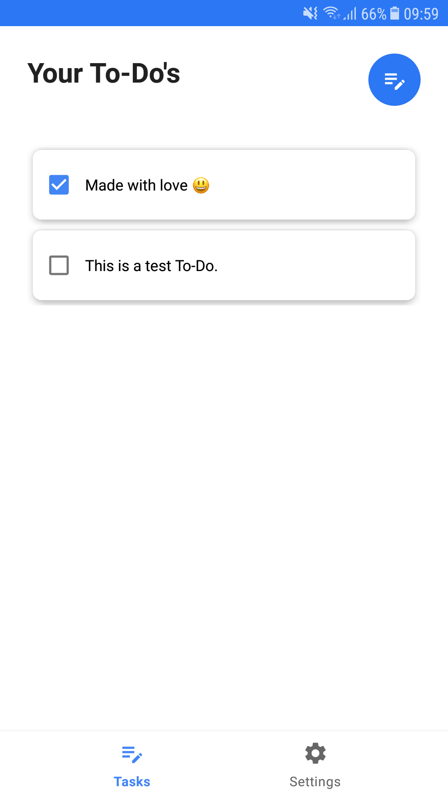
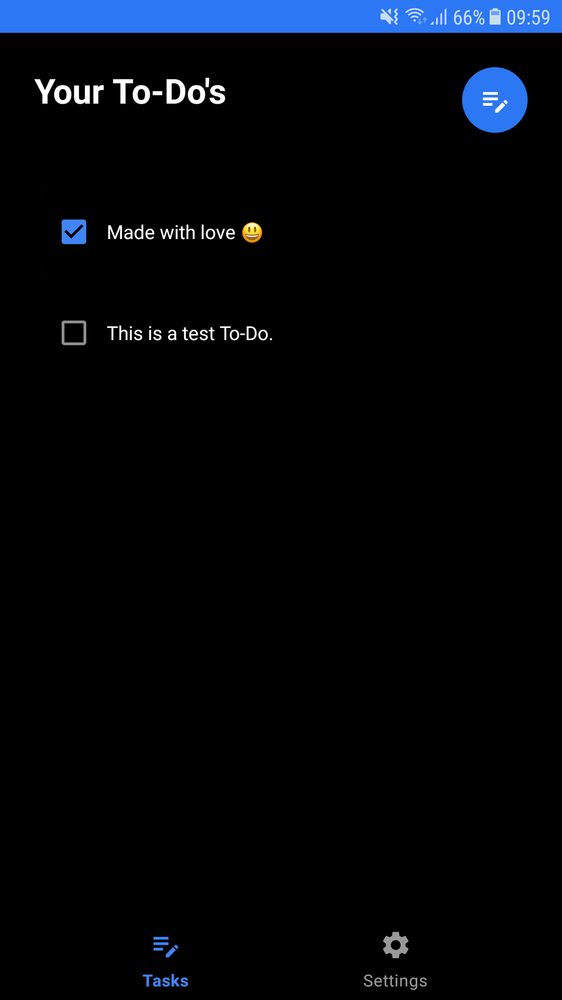

# Remind Me
Never miss a task again with Remind Me, the perfect ToDo app designed to keep you organized and on top of your daily activities. Whether you're a busy professional, a student with a hectic schedule, or someone who just wants to stay on track, Remind Me is here to make your life easier.

## Features

1. Open source and completely free
2. Offline to make it more secure
3. Modern and simple design
4. Dark mode support

## Used Technologies

1. Android Studio
2. Room Library to access SQLite database.
3. Shared Preferences to configure dark mode.
    
## Screenshot

<table>
  <tr>
    <td> </td>
   </tr> 
</table>

<table>
  <tr>
    <td> </td>
   </tr> 
</table>

It's in early stage, it'll have new features.

## Planning

1. Seperate done tasks and add some animations.
2. Add onboarding screens.
3. Improve dark mode.
4. Add notification service.
5. Add some UI sounds to make it better.
6. Take To-Do backups to internal storage.
7. Add password and biometric protection.
8. Add more themes to make it fresh.
9. Use MVVM architecture and Compose UI.
10. Add widget support and photos to background.
